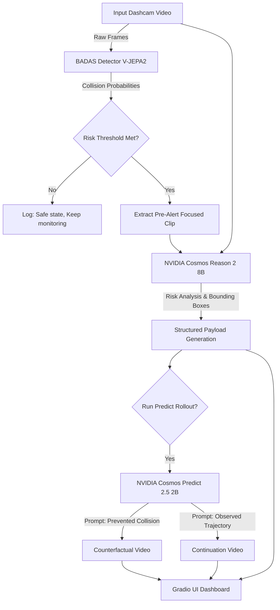

# Cosmos Sentinel 🚦

Cosmos Sentinel is an agentic, demo-first traffic safety pipeline. It evaluates dashcam and traffic videos by combining early-warning collision prediction with high-level multimodal reasoning and future-state video generation.

**[Live Gradio Space](https://huggingface.co/spaces/Ryukijano/Cosmos_Sentinel)** 

## 🏗️ Architecture

Cosmos Sentinel runs a three-stage intelligent pipeline:

1. **Gate:** [BADAS (Ego-Centric Collision Prediction)](https://huggingface.co/nexar-ai/BADAS-Open) acts as a high-frequency predictive gate. It processes the video using V-JEPA2 to find the exact high-risk collision timeframe.
2. **Reason:** [NVIDIA Cosmos Reason 2](https://github.com/nvidia-cosmos/cosmos-reason2) provides incident understanding. It takes the full video, the BADAS-identified high-risk clip, and generates structured analysis (severity, actor behavior, environmental hazards).
3. **Predict:** [NVIDIA Cosmos Predict 2.5](https://github.com/nvidia-cosmos/cosmos-predict2.5) acts as a world-simulator. Based on the Reason narrative, it performs "what-if" rollouts (e.g., generating a future where the collision is prevented vs. observed).

### Flow Diagram



## 🚀 Features

- **End-to-End Pipeline:** Fully orchestrated from raw MP4 video to intelligent analysis and generated video continuations.
- **Gradio UI:** An optimized Gradio interface for Hugging Face Spaces with ZeroGPU support and intelligent model caching.
- **Visual Diagnostics:** Generates gradient saliency maps, bounding box overlays, risk gauges, and artifact heatmaps dynamically.

## 📂 Repository Structure

```text
.
├── app.py                    # Gradio UI (Hugging Face Spaces entry point)
├── badas_detector.py         # BADAS model loading and sliding-window inference
├── cosmos_risk_narrator.py   # Cosmos Reason 2 prompt building and inference
├── cosmos_predict_runner.py  # Cosmos Predict 2.5 generation logic
├── extract_clip.py           # Focused clip extraction utility
└── main_pipeline.py          # CLI orchestration for the full pipeline
```

## 💻 Quickstart

### 1. Requirements

- NVIDIA GPU (Ampere or newer, e.g., RTX 3090, A100, H100)
- Linux (Ubuntu 22.04+)
- Python 3.10+

### 2. Install Dependencies

```bash
pip install -r requirements.txt
```

*Note: If you want to use the Cosmos Predict module locally, you must follow the [Cosmos Predict 2.5 Setup Guide](https://github.com/nvidia-cosmos/cosmos-predict2.5/blob/main/README.md) to install its specific `uv` workspace dependencies.*

### 3. Authentication

You need a Hugging Face token to download the gated models (BADAS and Cosmos).

```bash
export HF_TOKEN="your_hugging_face_token"
# Optional: Set a persistent cache directory to avoid re-downloading models
export HF_HOME="/path/to/your/large/storage/.huggingface"
```

### 4. Run the Gradio App

```bash
python app.py
```

## ☁️ Hugging Face Space Deployment

This branch (`huggingface-spaces`) is the source for the [Cosmos Sentinel Hugging Face Space](https://huggingface.co/spaces/Ryukijano/Cosmos_Sentinel). Push directly to HF Spaces from this branch.

It is optimized for:
- **ZeroGPU:** Dynamic `@spaces.GPU` allocation to prevent timeouts during long downloads.
- **Persistent Storage:** Reads `HF_HOME=/data/.huggingface` to cache the 30GB+ of models across restarts.
- **Graceful Degradation:** Skips Cosmos Predict locally in the Space to avoid complex workspace dependency issues, focusing purely on the core BADAS + Reason pipeline.

## 📚 Acknowledgements & References

- [BADAS: Ego-Centric Collision Prediction](https://arxiv.org/abs/2510.14876)
- [NVIDIA Cosmos Models Overview](https://docs.nvidia.com/cosmos/latest/introduction.html)
- [NVIDIA Cosmos Reason 2 GitHub](https://github.com/nvidia-cosmos/cosmos-reason2)
- [NVIDIA Cosmos Predict 2.5 GitHub](https://github.com/nvidia-cosmos/cosmos-predict2.5)
