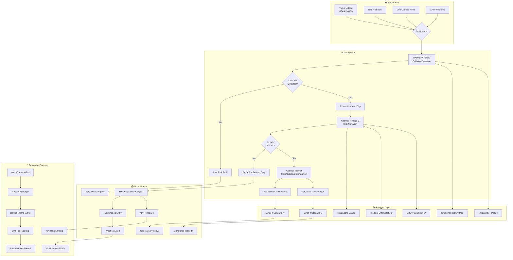
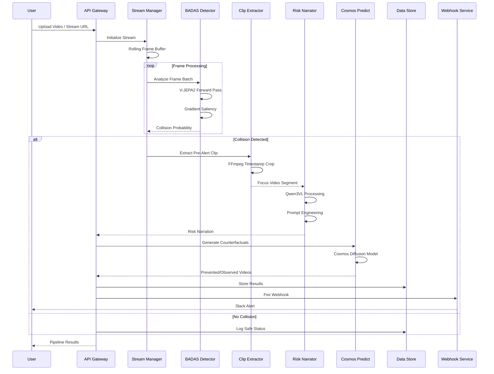
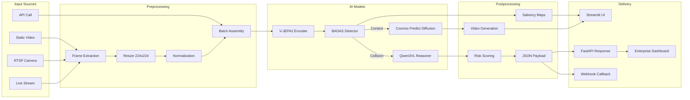
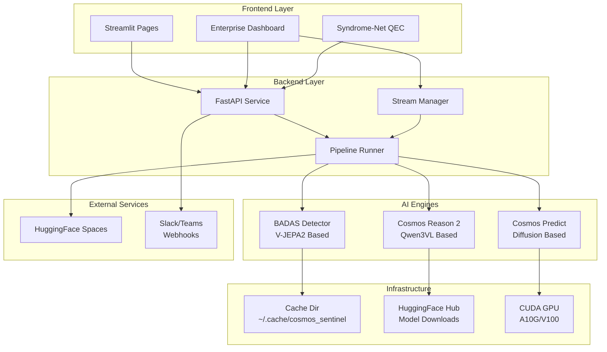
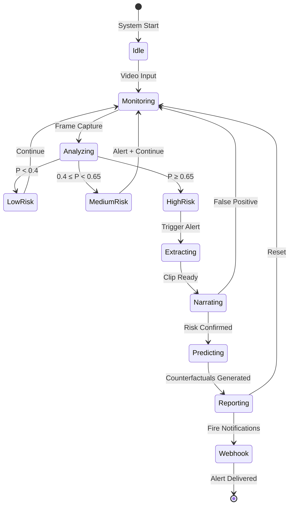
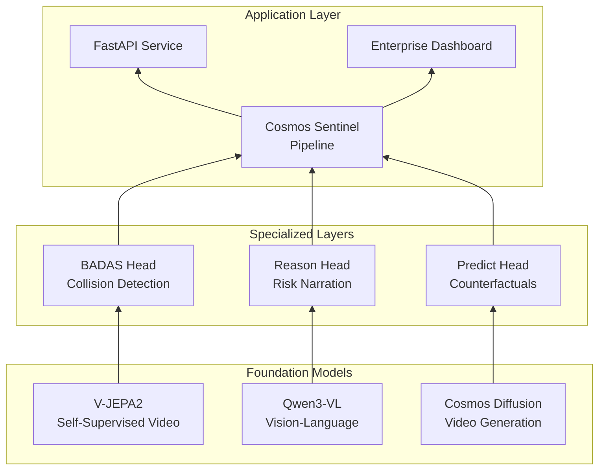
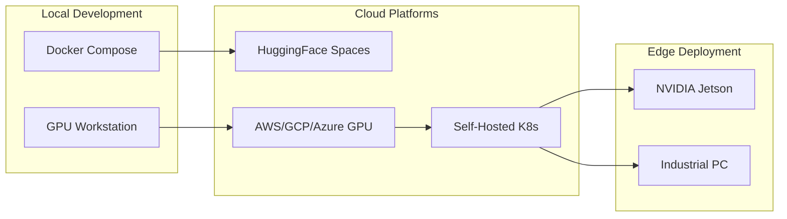

# Cosmos Sentinel Workflow Architecture

## System Overview



## Detailed Pipeline Flow



## Data Flow Architecture



## Component Interactions



## Risk Assessment State Machine



## Enterprise API Flow

```mermaid
flowchart TD
    subgraph Client["API Client"]
        C1[HTTP Request]
        C2[X-API-Key Header]
    end

    subgraph Gateway["API Gateway"]
        R1[Rate Limiter<br/>Sliding Window]
        R2[Auth Validator]
        R3[Job Queue]
    end

    subgraph Processing["Async Processing"]
        W1[Background Worker]
        W2[Video Analyzer]
        W3[Frame Analyzer]
    end

    subgraph Events["Event System"]
        E1[High Risk Detector]
        E2[Webhook Dispatcher]
        E3[httpx Async Client]
    end

    C1 -->|POST /analyze/video| R1
    C2 --> R2
    R1 -->|RPM Check| R2
    R2 -->|Valid| R3
    R3 -->|Job ID| C1
    R3 --> W1
    W1 --> W2
    W1 --> W3
    W2 --> E1
    E1 -->|P ≥ threshold| E2
    E2 --> E3
    E3 -->|POST JSON| C4[Slack/Teams]
    W2 -->|Result| R4[Job Store]
    C1 -->|GET /jobs/{id}| R4
```

## Model Architecture Stack



---

## Key Technologies

| Component | Technology | Purpose |
|-----------|------------|---------|
| Video Encoding | FFmpeg, Decord | Frame extraction & preprocessing |
| Vision Model | V-JEPA2 | Spatiotemporal representation learning |
| Language Model | Qwen3-VL | Multimodal risk narration |
| Generation | Cosmos Diffusion | Counterfactual video synthesis |
| API Framework | FastAPI | High-performance async API |
| UI Framework | Streamlit | Interactive dashboard & demos |
| Webhooks | httpx | Async webhook dispatch |
| Rate Limiting | In-Memory Sliding Window | API tier enforcement |
| Streaming | OpenCV, Threading | RTSP/MJPEG live feed handling |

## Deployment Options


